# Object Detection in an Urban Environment

## Goal

To classify and localize the cars, pedestrians and cyclists in camera input feed.

## Data

For this project, we will be using data from the [Waymo Open dataset](https://waymo.com/open/).


## Structure


### Data

The data we will use for training, validation and testing is organized as follow:
```
/home/workspace/data/waymo
    - training_and_validation - contains 97 files to train and validate your models
    - train: contain the train data (empty to start)
    - val: contain the val data (empty to start)
    - test - contains 3 files to test your model and create inference videos
```

The `training_and_validation` folder contains file that have been downsampled: we have selected one every 10 frames from 10 fps videos. The `testing` folder contains frames from the 10 fps video without downsampling.


## Local Setup

For local setup if you have your own Nvidia GPU, you can use the provided Dockerfile and requirements in the [build directory](./build).

Follow [the README therein](./build/README.md) to create a docker container and install all prerequisites.


### Download and process the data


**Note:** I used the Udacity Workspace, they already had the data processed ready to use.

The first goal of this project is to download the data from the Waymo's Google Cloud bucket to your local machine. For this project, we only need a subset of the data provided (for example, we do not need to use the Lidar data). Therefore, we are going to download and trim immediately each file. In `download_process.py`, you can view the `create_tf_example` function, which will perform this processing. This function takes the components of a Waymo Tf record and saves them in the Tf Object Detection api format. An example of such function is described [here](https://tensorflow-object-detection-api-tutorial.readthedocs.io/en/latest/training.html#create-tensorflow-records). We are already providing the `label_map.pbtxt` file.

You can run the script using the following command:
```
python download_process.py --data_dir {processed_file_location} --size {number of files you want to download}
```

You are downloading 100 files (unless you changed the `size` parameter) so be patient!


## Dataset


### Exploring dataset


| 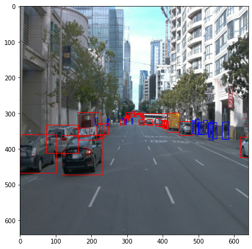  |  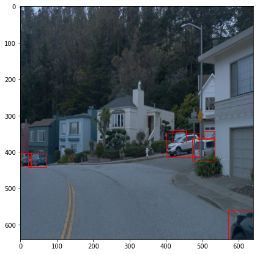 |
:-------------------------:|:-------------------------:
| 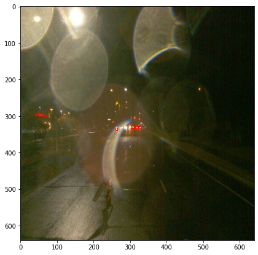  |  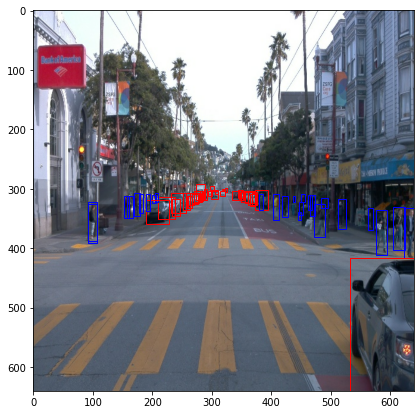 |
| 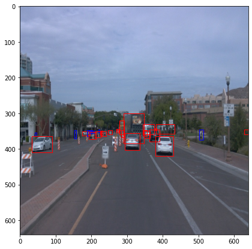  |  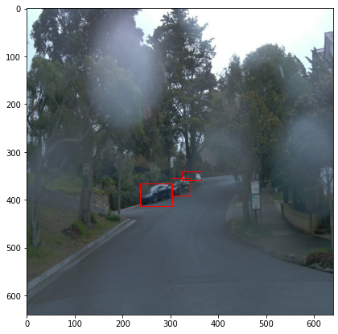 |


### Analysis


I have used random 30k samples from the dataset to analyse.

1. Dataset is very skewed in terms of number of samples available for each class. Class 1 of cars have maximum samples. Class 4 of cyclists is very rare in the dataset, followed by Class 2 of pedestrians.

    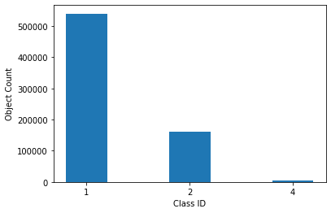


2. Distribution of object **center** in image: Image is split into 10*10 grid

   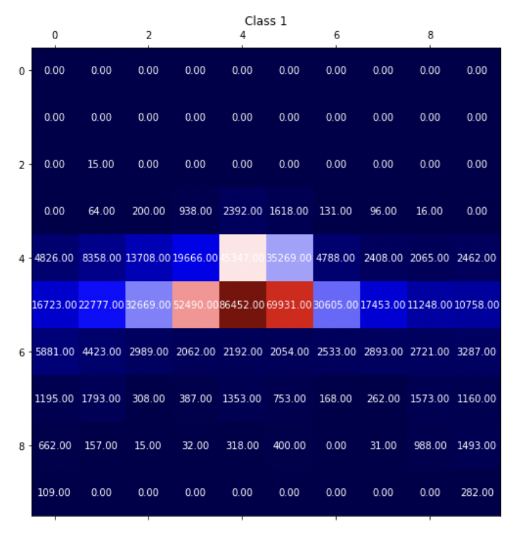 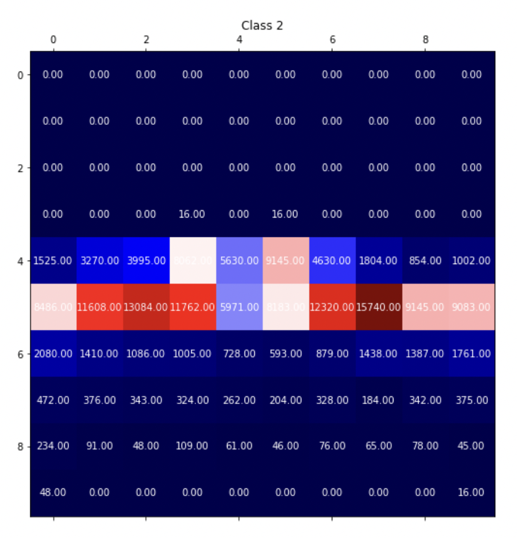
   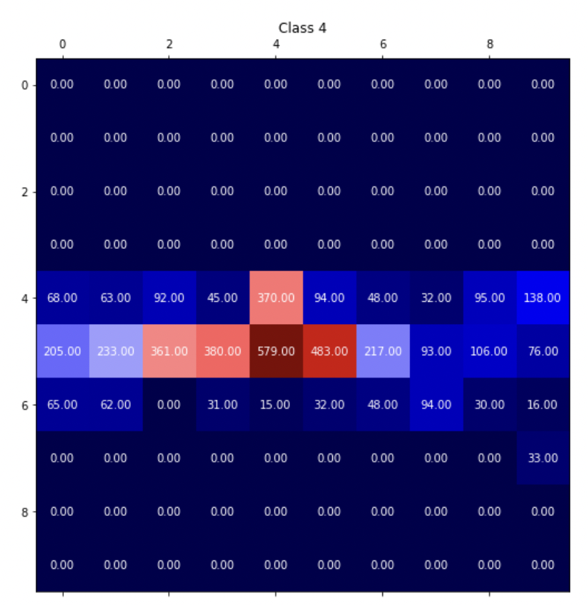

This analysis show that maximum object occur in the center, fewer on the sides, and no/less objects at the top/bottom of image. The dataset is little skewed horizontally, so, random horizontal flip should help.


3. Distribution of object bounding box in image: This shows how many times an object's bounding box is present at that location. Image is split into 10*10 grid

   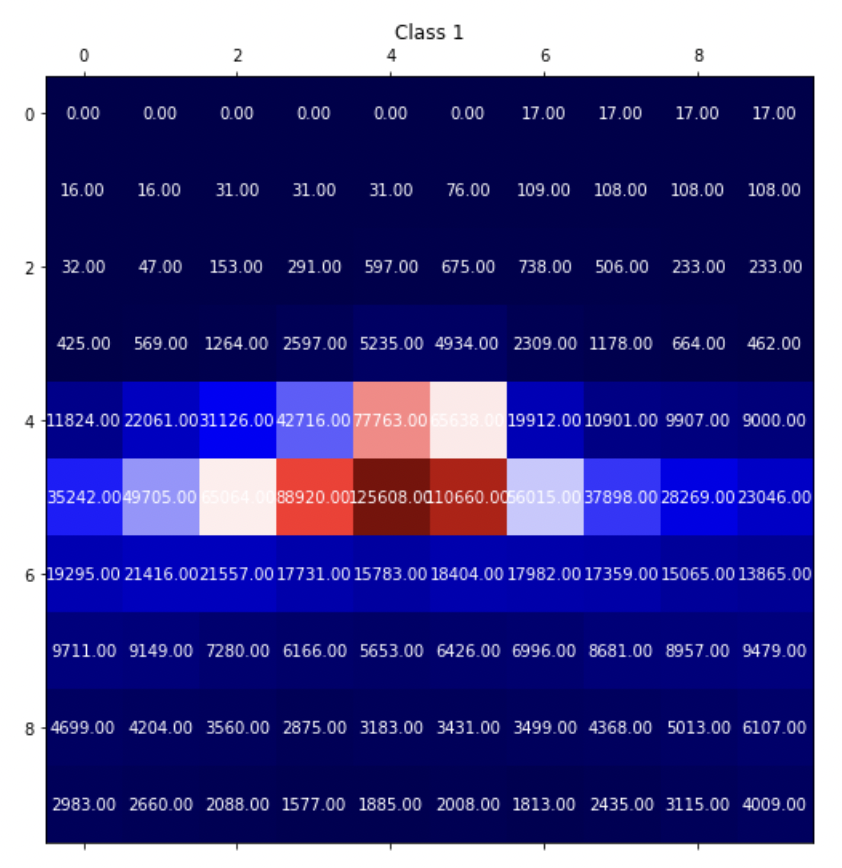 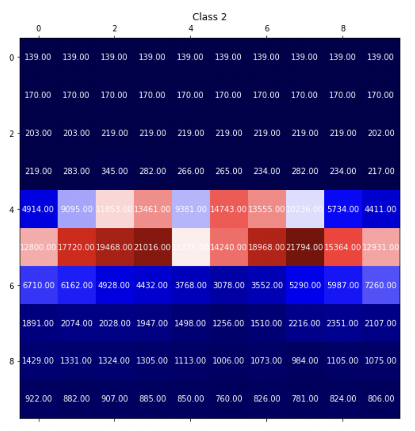
   


This and previous distribution show that although object center is usually in the center of image, but it's bounding boxes sometimes cover corners of the image. Since the dist shows high values in center, it also suggests that most bounding boxes cover center of the image.


4. Distribution of class frequency in an image

   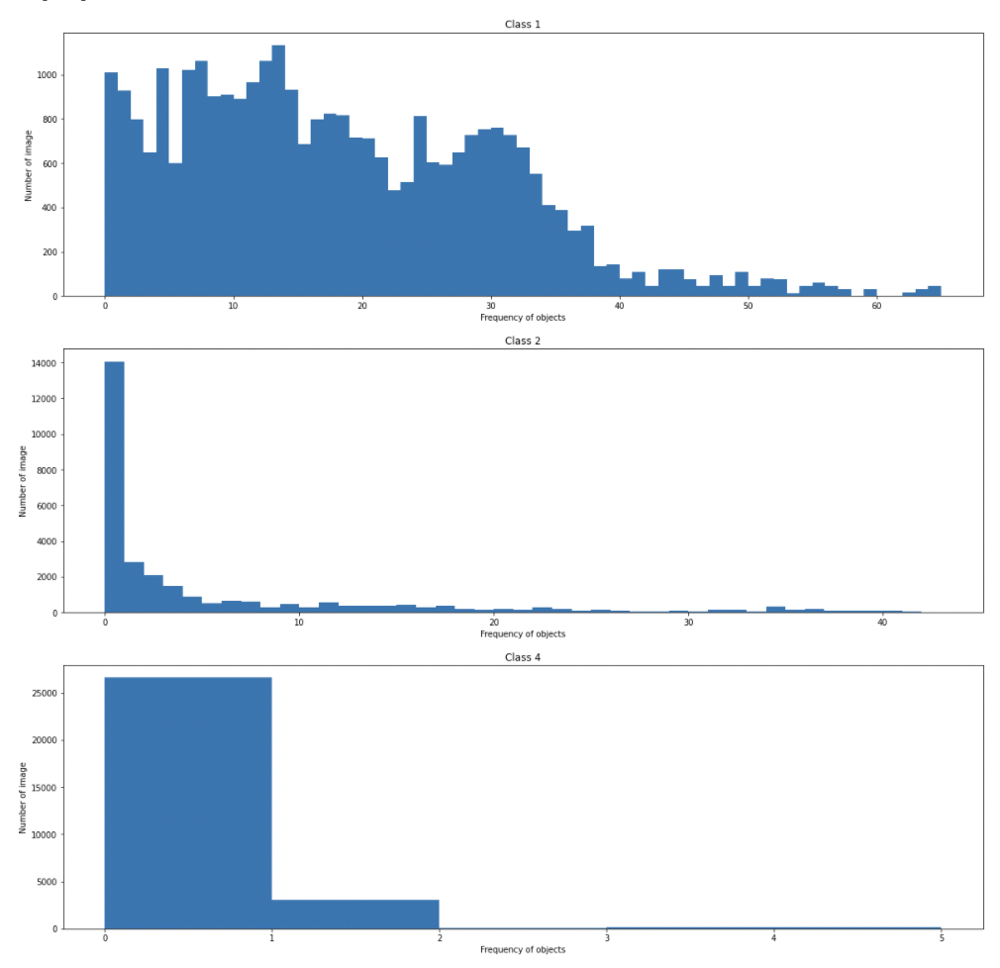


5. Also, surfing through the dataset suggests fewer samples in darker/foggy conditions compared to day/clear conditions. So, random brightness, contrast and color shift should help.


### Create the training - validation splits

Split the data into 87% train, 10% validation and 3% test.
Use the following command to run the script once your function is implemented:
```
python create_splits.py --data-dir /home/workspace/data
```

### The config file


The config that we will use for this project is `pipeline.config`, which is the config for a SSD Resnet 50 640x640 model. You can learn more about the Single Shot Detector [here](https://arxiv.org/pdf/1512.02325.pdf).

First, let's download the [pretrained model](http://download.tensorflow.org/models/object_detection/tf2/20200711/ssd_resnet50_v1_fpn_640x640_coco17_tpu-8.tar.gz) and move it to `/home/workspace/experiments/pretrained_model/`.

We need to edit the config files to change the location of the training and validation files, as well as the location of the label_map file, pretrained weights. We also need to adjust the batch size. To do so, run the following:
```
python edit_config.py --train_dir /home/workspace/data/train/ --eval_dir /home/workspace/data/val/ --batch_size 2 --checkpoint /home/workspace/experiments/pretrained_model/ssd_resnet50_v1_fpn_640x640_coco17_tpu-8/checkpoint/ckpt-0 --label_map /home/workspace/experiments/label_map.pbtxt
```
A new config file has been created, `pipeline_new.config`.


### Training


Model and training hyperparameters are defined using a file, pipeline_new.config.
You can make changes in this config file, then move the `pipeline_new.config` to the `/home/workspace/experiments/reference` folder. Now launch the training process:
* a training process:
```
python experiments/model_main_tf2.py --model_dir=experiments/reference/ --pipeline_config_path=experiments/reference/pipeline_new.config
```
Once the training is finished, launch the evaluation process:
* an evaluation process:
```
python experiments/model_main_tf2.py --model_dir=experiments/reference/ --pipeline_config_path=experiments/reference/pipeline_new.config --checkpoint_dir=experiments/reference/
```

**Note**: Both processes will display some Tensorflow warnings, which can be ignored. You may have to kill the evaluation script manually using
`CTRL+C`.

To monitor the training, you can launch a tensorboard instance by running `python -m tensorboard.main --logdir experiments/reference/`. You will report your findings in the writeup.


### Augmentation

Explored the Object Detection API and applied many different augmentations

Used various augmentation strategies:
1. random_horizontal_flip
2. random_crop_image
3. random_adjust_brightness
4. random_adjust_contrast
5. random_adjust_hue
6. random_adjust_saturation
7. random_distort_color


| 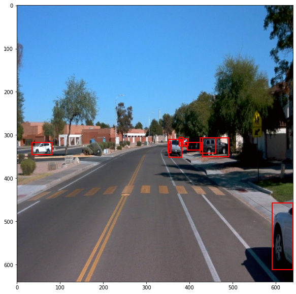  |  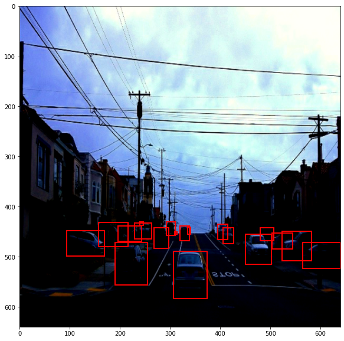 |
:-------------------------:|:-------------------------:
|   |  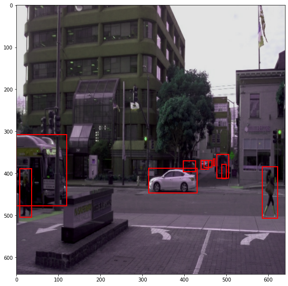 |
| 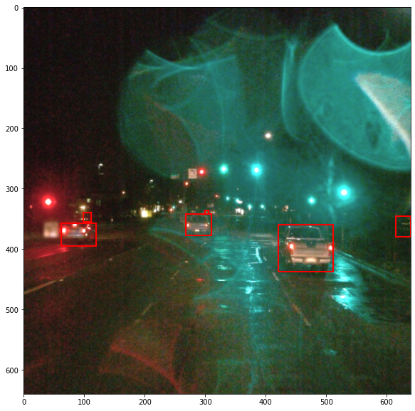  |  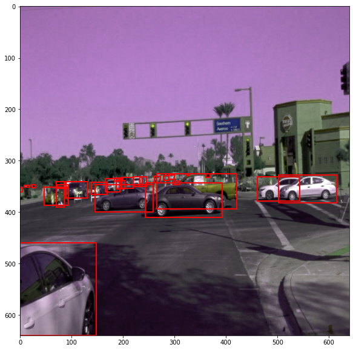 |


### Experiment

Used SGD with momentum. Rate decay: Cosine anealing. Changed warmup learning rate to 5e-4, warmup steps to 300 and total steps to 5000 to get the desired learning rate function.

Stopped training at 3k steps just before our model would start overfitting. Although, training loss is still decreasing, but validation loss and mAP have plateaued. So, further training would overfit the dataset.


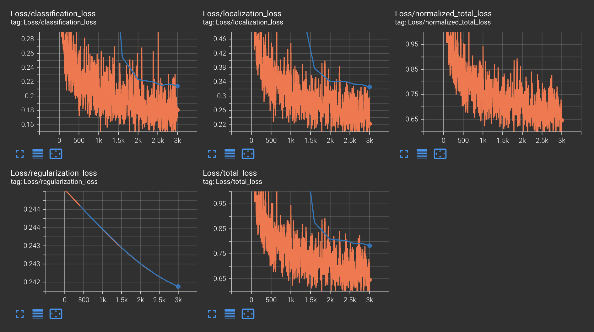


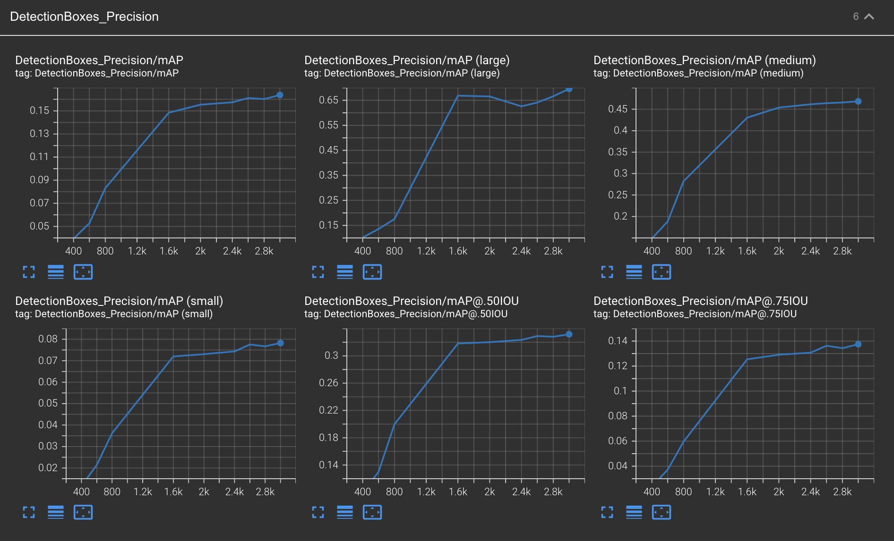


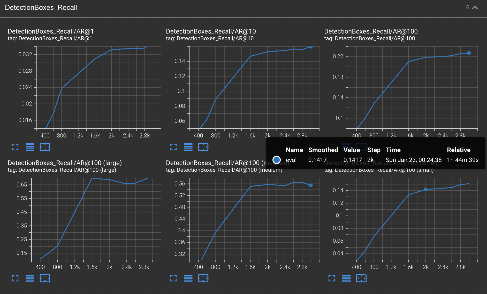


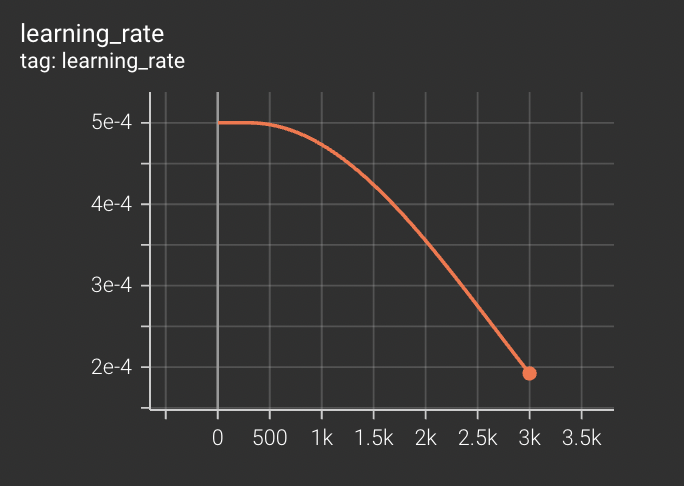


### Creating an animation

#### Export the trained model

Modify the arguments of the following function to adjust it to your models:

```
python experiments/exporter_main_v2.py --input_type image_tensor --pipeline_config_path experiments/reference/pipeline_new.config --trained_checkpoint_dir experiments/reference/ --output_directory experiments/reference/exported/
```

This should create a new folder `experiments/reference/exported/saved_model`. You can read more about the Tensorflow SavedModel format [here](https://www.tensorflow.org/guide/saved_model).

Finally, you can create a video of your model's inferences for any tf record file. To do so, run the following command (modify it to your files):
```
python inference_video.py --labelmap_path label_map.pbtxt --model_path experiments/reference/exported/saved_model --tf_record_path data/waymo/test/segment-12200383401366682847_2552_140_2572_140_with_camera_labels.tfrecord --config_path experiments/reference/pipeline_new.config --output_path animation.gif
```

## Test results


## Future Work

1. Based on the observation of test animation, bounding box predictions are not stable in every frame (bounding box not detected for some cars in intermediate frames). One possible solution is to use a Recurrent Neural Network (RNN).
2. More time can be spent on find the right hyperparameters. Due to very limited compute resources, this could not be done.
